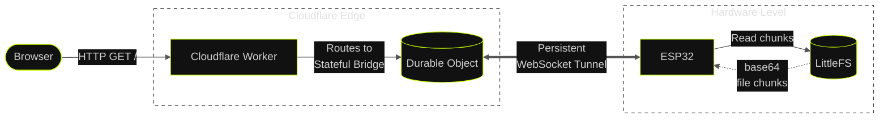

# Pocket Web

Host a personal website on a **$4 ESP32 microcontroller** tunnelled to the open internet via a Cloudflare Durable Object, with zero port-forwarding and zero VPN.

> Live at → [esp.shivzee.in](https://esp.shivzee.in)

---

<!-- Add a screenshot or photo of your setup here -->
<!-- Example:  -->

---

## Why?

Because a $4 microcontroller has 520 KB of RAM and two cores and most of it was just sitting idle.

This project started while studying **Cloudflare Durable Objects**. I wanted my ESP32 to serve real content to the internet without exposing my home network, running cloudflared, or paying for a VPS. Durable Objects turned out to be the perfect persistent middleman a single globally-unique instance that can hold a live WebSocket connection to my hardware forever.

→ [Read more at esp.shivzee.in/why](https://esp.shivzee.in/why)

---

## How it works

An HTTP request hits a **Cloudflare Worker**. The Worker forwards it to a **Durable Object** (`EspHub`) which holds a persistent WebSocket connection to your ESP32. The board reads the requested file from its **1.5 MB LittleFS flash partition**, chunks it in base64, and streams it back over the WebSocket. Cloudflare reassembles and delivers it to the browser.



Because the ESP32 barely breaks a sweat serving files, Core 0 runs a **Duino-Coin miner** as a pinned FreeRTOS task squeezing every cycle out of the chip.

→ [Read in detail at esp.shivzee.in/how](https://esp.shivzee.in/how)

---

## Project Structure

```
pocket-web/
├── core/
│   └── esp/
│       ├── esp.ino              # Main Arduino sketch (WebSocket server + miner)
│       ├── DSHA1.h              # Optimised SHA-1 for Duino-Coin mining
│       ├── Counter.h            # Base-36 counter for mining loop
│       ├── secrets.h            # Your credentials (git-ignored)
│       ├── example.secrets.h    # Template — copy → secrets.h and fill in
│       └── data/                # Static assets flashed to LittleFS
├── web/
│   └── src/
│       ├── pages/               # Astro pages (index, how, why)
│       ├── components/          # Sidebar etc.
│       ├── layouts/             # Base HTML layout
│       ├── assets/              # SVGs, images
│       └── styles/              # global.css
└── worker/
    ├── worker.js                # Cloudflare Worker + EspHub Durable Object
    ├── wrangler.toml            # Wrangler config
    └── pages/                   # Offline / timeout HTML pages
```

---

## Prerequisites

- **ESP32** (any variant with dual-core — WROOM, S3, etc.)
- **Arduino IDE** or **PlatformIO** with ESP32 board support
- **Cloudflare account** (free tier is fine)
- **Wrangler CLI** (`npm i -g wrangler`)
- **Bun** or **Node.js** for the web build

### Arduino Libraries

Install via Arduino Library Manager:

| Library | Purpose |
|---|---|
| `ArduinoWebsockets` | WebSocket client |
| `ArduinoJson` | JSON (de)serialisation |
| `LittleFS` | Flash filesystem |

---

## Setup

### 1. Cloudflare Worker

```bash
cd worker
bun install          # or npm install
```

Set your secret connection key (used to authenticate the ESP32):

```bash
wrangler secret put ESP_CONNECTION_KEY
# Enter a strong random string and remember it
```

Deploy:

```bash
wrangler deploy
```

Note the Worker URL — it looks like `https://esp32-tunnel.<account>.workers.dev`.

---

### 2. ESP32 Firmware

**Copy and fill in secrets:**

```bash
cp core/esp/example.secrets.h core/esp/secrets.h
```

Edit `secrets.h`:

```cpp
// Wi-Fi
const char* ssid     = "YOUR_WIFI_SSID";
const char* password = "YOUR_WIFI_PASSWORD";

// Cloudflare Worker — must match ESP_CONNECTION_KEY secret you set above
const char* ESP_SECURE_KEY = "your-secret-key-here";

// Full WebSocket URL (ws:// not https://)
const char* worker_url = "ws://esp32-tunnel.<account>.workers.dev/?device=esp32";

// Duino-Coin (optional miner — leave as-is to skip)
const char* DUCO_USER      = "YOUR_DUCO_USERNAME";
const char* DUCO_MINER_KEY = "None";
const char* DUCO_RIG_ID    = "Auto";
```

**Flash the firmware:**

Open `core/esp/esp.ino` in Arduino IDE, select your board & port, then **Upload**.

**Flash the web assets to LittleFS:**

Build the web first:

```bash
cd web
bun install
bun run build        # outputs to web/dist/
```

Copy the built files into `core/esp/data/`, then use **Arduino IDE → Tools → ESP32 Sketch Data Upload** (or `esptool`) to flash LittleFS.

---

### 3. Web (Astro)

```bash
cd web
bun install
bun run dev          # local dev server at http://localhost:4321
bun run build        # production build → dist/
```

---

## Architecture — ESP32 Dual-Core

The sketch uses FreeRTOS to fully utilise both cores:

| Core | Task | Description |
|------|------|-------------|
| **Core 1** (default) | `loop()` | WebSocket polling — serves files to Cloudflare |
| **Core 0** | `minerTask` | Duino-Coin mining loop pinned via `xTaskCreatePinnedToCore` |

The miner calls `esp_task_wdt_reset()` every ~100 ms and yields with `vTaskDelay(1)` between iterations so the IDLE task on Core 0 feeds the watchdog and prevents reboots.

```cpp
xTaskCreatePinnedToCore(
  minerTask,        // function
  "DUCOMiner",      // task name
  16384,            // stack size (bytes)
  nullptr,          // param
  1,                // priority
  &minerTaskHandle, // handle
  0                 // pin to Core 0
);
```

---

## How the WebSocket file serving works

1. Browser hits `https://your-worker.workers.dev/how`
2. Worker routes it to the `EspHub` Durable Object
3. Durable Object sends `{ action: "getFile", path: "/how/index.html", reqId: "..." }` over the persistent WebSocket to the ESP32
4. ESP32 opens the file from LittleFS, encodes chunks as base64, sends `fileStart → fileChunk… → fileEnd`
5. Durable Object reassembles the chunks, decodes base64 → `Uint8Array`, returns as an HTTP response with the correct `Content-Type`

Files are served gzip-compressed if a `.gz` variant exists on LittleFS — the Worker sets `Content-Encoding: gzip` transparently.

---

## Security

- The ESP32 authenticates with a **pre-shared secret key** passed as a query parameter (`?key=...`) over WebSocket.
- The Worker validates the key against the `ESP_CONNECTION_KEY` environment secret before accepting the connection.
- Any connection attempt without the correct key is rejected with `401 Unauthorized`.

> **Never commit `secrets.h`** — it is listed in `.gitignore`.

---

## Open Source

Author: **Shivzee**
<br />
[Buy me a coffee ☕](https://buymeacoffee.com/shivzee)

### Dependencies

**ESP firmware**
- [ArduinoWebsockets](https://github.com/gilmaimon/ArduinoWebsockets)
- [ArduinoJson](https://arduinojson.org/)
- [LittleFS](https://github.com/lorol/LITTLEFS)
- [mbedTLS](https://github.com/Mbed-TLS/mbedtls) (bundled with ESP-IDF, used for base64)

**Web**
- [Astro](https://astro.build/)

**Worker**
- [Cloudflare Workers](https://workers.cloudflare.com/)
- [Durable Objects](https://developers.cloudflare.com/durable-objects/)
